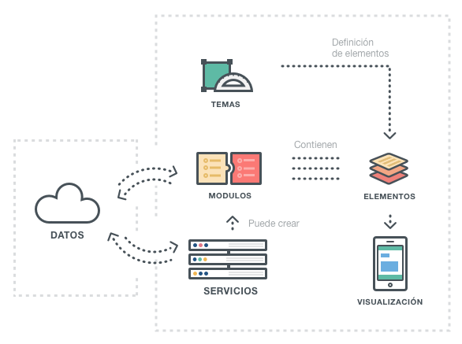
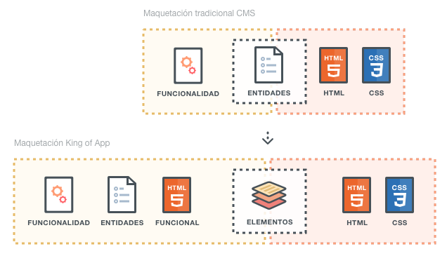

# Introducción al desarrollo con KingOfApp

A continuación vamos a explicar los conceptos básicos que tienes que conocer antes de empezar a desarrollar con KingOfApp.

## Proyectos y herramientas

A modo de resumen vamos a explicar cada uno de los proyectos que forman parte de KingOfApp, para qué sirven y dónde puedes encontrar más información sobre ellos.

| Proyecto   | Descripción | Enlaces de interés |
| :--------: | ----------- | :------------ |
| Builder    | Es la herramienta que nos permite construir de forma sencilla aplicaciones en base a la creación de un fichero de configuración. También nos permite, una vez creada nuestra aplicación, descargar el código fuente. Recomendamos el uso de esta aplicación para la creación de apps. | <ul><li>[Documentación](../getting_started/builder/readme.md)</li><li>[Herramienta](http://builder.kingofapp.com)</li></ul> |
| Visualizer | Es la base de la tecnología de KingOfApp y está integrado dentro de todas las aplicaciones construidas con KingOfApp. Este proyecto se encarga de cargar cada uno de los plugins y de hacer que funcionen correctamente. Es necesario para desarrollar cualquier módulo de KingOfApp. | <ul><li>[Documentación](visualizer/readme.md)</li> <li>[Código](https://github.com/KingofApp/com.kingofapp.visualizer)</li> <li>Demo (En construcción) |
| KoApp Tools | Es un grupo de herramientas de línea de comandos que simplifica la creación de aplicaciones. | <ul><li>[Documentación](koapp_cli/readme.md)</li> <li>[Instalación](https://www.npmjs.com/package/koapp-cli)</li></ul> |
| Angular Formly Koapp | Esta herramienta sirve para maquetar correctamente los formularios de configuración de los módulos y servicios. |  <ul><li>Documentación (ToDo)</li> <li>[Código](https://github.com/KingofApp/angular-formly-templates-koapp)</li><li>[Demo](http://jsbin.com/qiwoxa/edit?html,css,js,output)</li></ul> |
| Koapp Widget Communicator | Esta librería crea una interfaz de comunicaciones entre el builder y el panel de administración de un módulo. | <ul><li>[Documentación y Código](https://github.com/KingofApp/koapp-widget-communicator)</li></ul> |

## Configuración de la app

Los fundamentos de la tecnología de KingOfApp se basan en la reutilización del código, por este motivo todos los elementos que se utilizan dentro de la plataforma, se añaden como plugins.

Con el fin de hacer mas versátil la configuración de la aplicaciones, toda la información se puede representar en forma de un único fichero de configuración con formato JSON. El nombre del fichero de configuración es `structure.json` y puede encontrarse dentro de la carpeta `core` del proyecto visualizer.

## Tipos de plugins y su uso

Los plugin son todas aquellas piezas de código que nos permiten añadir o modificar las características de una app.

A continuación, describiremos la filosofía que hay detrás de cada uno de ellos y como interactúan entre sí:

### Temas

- **Función:** Permiten cambiar el estilo gráfico de cada módulo siguiendo las guías de diseño recomendadas por KingOfApp.
- **Nº máximo por app:** 1
- **Descripción:** Es el tipo de plugin más sencillo. Define una serie de componentes gráficos que son reutilizados por los módulos para mostrar el contenido.

### Módulos

- **Función:** Permiten crear vistas e interactuar con el contenido. Dichas vistas son las responsables de conectarse a fuentes de datos para mostrarlos e interactuar con ellos de la manera deseada.
- **Nº máximo por app:** Cualquier cantidad.
- **Descripción:** Son los encargados de crear vistas, de la navegación entre secciones y de definir todas las interacciones con el usuario.

### Servicios

- **Función:** Permiten crear lógica que corre en segundo plano.
- **Nº máximo por app:** Cualquier cantidad.
- **Descripción:** Son capaces de enlazar servicios transversales, como pueden ser las notificaciones push o conectarse a servicios de analíticas. Una de sus principales ventajas es que permiten la creación y configuración de módulos en tiempo de ejecución. Esto permite añadir sistemas de login configurados en base a vistas que hay que proteger o añadir pasos adicionales al flujo de una aplicación en caso de que el usuario tenga que realizar acciones obligatorias antes de acceder a todas las funcionalidades. Un proceso de iniciación o un *walkthrow* pueden ser algunos ejemplos

## Modelos de datos

En KingOfApp creemos que limitar la funcionalidad de las aplicaciones móviles ligándolas a un formato de datos fijo no es bueno, por eso trabajamos siempre con modelos de datos libres.

**Entonces... ¿Cómo se maqueta el contenido?**

La respuesta es sencilla, en base a su función dentro de la vista. Si nos fijamos en la mayoría de aplicaciones móviles, vemos que los mismos patrones se repiten una y otra vez. En KoApp hemos evaluado cuáles de estos elementos son los que componen un set funcional básico y los hemos agrupados en temas.

Por otro lado, cuando necesitas mostrar información desde un módulo, solamente necesitas elegir qué componente es el más adecuado para mostrar tu información en vez de dar un aspecto concreto.

Este enfoque es radicalmente diferente a otros CMS. En un CMS como WordPress, podemos observar cómo los datos o entidades (título, descripción, autor, ...), son el punto de separación entre el trabajo visual y el funcional. En KingOfApp, al no tener un set de datos definido, hemos creado los elementos para que actúen como intermediarios y así poder permitir que los desarrolladores trabajen en la parte funcional y los diseñadores en la visual.

Esto facilita cambiar el aspecto de cualquier app con tan solo seleccionar un nuevo tema.

**¿Qué pasa si no hay un elemento que se comporte como yo quiero?**

En ese caso, puedes maquetar con componentes básicos HTML, siendo importante seguir las guías para que dicha maquetación pueda adaptarse en cuanto a colores y formas. En la sección de plantillas puedes encontrar [más información](themes.md) al respecto.
