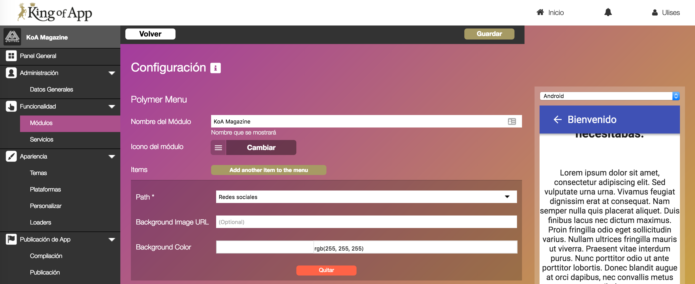

# Interacción con el Usuario


> Mantener menos html en favor de JavaScript
> - [Angular-formly](http://angular-formly.com/#/)

King of App integra Angular-formly para la gestión de las preferencias de los usuario sobre los módulos en el Builder.

### Trabajar con Angular-Formly

Angular-Formly nos permite crear todos los campos del formulario de preferencias de nuestro módulo desde JavaScript sin tener que preocuparnos por el Html o el Css.

- [Ejemplo Oficial](http://jsbin.com/kunaho/47/edit)

**Características**

- [Expression Properties](http://angular-formly.com/#/example/field-options/expression-properties)
  Nos permiten cambiar dinámicamente los campos y su contenido

- [Valores por defecto](http://angular-formly.com/#/example/field-options/default-value)  Permite declarar valores por defecto

- [Campos Ocultos](http://angular-formly.com/#/example/field-options/hide-fields)
  Permite el uso de campos ocultos

- [Watchers](http://angular-formly.com/#/example/field-options/watchers)
  Permite observar dinámicamente los datos que se introducen en el formulario

- [Focus](http://angular-formly.com/#/example/field-options/focus)
  Permite controlar el focus en los campos del formulario

- [Parseadores y formateadores](http://angular-formly.com/#/example/field-options/parsers-and-formatters)
  Permite cambiar y validar el input del usuario


### Plantillas de King of App

Hemos [extendido las funcionalidades](http://docs.angular-formly.com/v6.4.0/docs/custom-templates) de Angular-Formly utilizando [nuestro propio sistema de plantillas](https://github.com/KingofApp/angular-formly-templates-koapp)


*Importante:* Nuestras modificaciones se soportan desde la versión *Angular-formly 3.0.0* en la propiedad *templateOptions*


**Input**
Input utiliza el elemento `<input>` y se puede especificar desde la propiedad *type*.

[Demo](http://jsbin.com/qiwoxa/edit?html,css,js,output)

*Ejemplo:*
```javascript
{
  "type": "input",
  "key": "firstName",
  "templateOptions": {
    "type": "email", // or url, or text, etc.
    "placeholder": "jane doe",
    "label": "First name"
  }
}
```


**multiInput**

multiInput permite incluir diversos conjuntos de *inputs* que se enlazan con el valor del modelo.

[Demo](http://jsbin.com/zuqiba/edit?html,css,js,output)

*Ejemplo:*
```json
{
  "key": "kids",
  "type": "multiInput",
  "templateOptions": {
    "label": "Kids",
    "inputOptions": {
      "type": "input"
    }
  }
}
```


**Textarea**

Nos permite definir un campo multilinea.

El tamaño del *textarea* se define con las propiedades (opcionales) *rows* y *cols*

[Demo](http://jsbin.com/bumilo/edit?html,css,js,output)

*Ejemplo:*
```json
{
  "type": "textarea",
  "key": "about",
  "templateOptions": {
    "placeholder": "I like puppies",
    "label": "Tell me about yourself",
    "rows": 4,
    "cols": 15
  }
}
```


**Wysiwyg**

Permite crear un editor de texto que luego es convertido a html.

[Demo](http://jsbin.com/mufoyu/edit?html,css,js,output)

*Ejemplo:*
```json
{
  "key": "wysiwyg",
  "type": "wysiwyg",
  "className": "wysiwyg",
  "templateOptions": {
    "label": "Wysiwyg"
  }
}
```


**Frame**

Crea un botón que al ser accionado despliega un iframe dentro de un *modal* con una vista customizada para facilitar la configuración por parte del usuario.

Es necesario completar las propiedades *url (vista que será mostrada)* y *buttonText (que sera el mensaje del botón)*.

La propiedad *width* y *height* son opcionales y definen el tamaño del iframe.

*Ejemplo:*
```json
{
  "type": "frame",
  "templateOptions": {
    "label": "Easy configuration",
    "description": "Click here to configure module",
    "url": "/modules/moduleName/widget/configure.html",
    "buttonText": "Configure",
    "width": 450,
    "height": 700
  }
}
```


**Checkbox**

Crea un input tipo checkbox, no tiene customización posible.

[Demo](http://jsbin.com/dekegi/edit?html,css,js,output)

*Ejemplo:*
```json
{
  "type": "checkbox",
  "key": "checkThis",
  "templateOptions": {
    "label": "Check this box"
  }
}
```


**multiCheckbox**

Nos permite incluir un conjunto de inputs tipo *checkbox* que se enlazan con el valor del modelo.

Debemos configurarlo mediante la propiedad *options* que espera un array de objetos con las propiedades *id (identificador)* y *title (título mostrado)*

Opcionalmente podemos definir *labelProp (label mostrada al usuario. Por defecto "name")* y *valueProp (Valor asignado al modelo, por defecto "value")*

[Demo](http://jsbin.com/xirivup/edit?html,css,js,output)

*Ejemplo:*
```json
{
  "key": "roles",
  "type": "multiCheckbox",
  "templateOptions": {
    "label": "Roles",
    "options": [{"id": 1, "title" : "Administrator"}, {"id": 2, "title" : "User"}],
    "valueProp": "id",
    "labelProp": "title"
  }
}
```


**Radio**

Input de tipo radio que nos permite seleccionar una única opción entre multiples..

Debemos configurarlo mediante la propiedad *options* que espera un array de objetos con las propiedades *name (texto que se mostrará)* y *value (retorno)*

[Demo](http://jsbin.com/vayalob/edit?html,css,js,output)

*Ejemplo:*
```json
{
  "key": "triedEmber",
  "type": "radio",
  "templateOptions": {
    "label": "Have you tried EmberJs yet?",
    "options": [
      {
        "name": "Yes, and I love it!",
        "value": "yesyes"
      },
      {
        "name": "Yes, but I'm not a fan...",
        "value": "yesno"
      },
      {
        "name": "Nope",
        "value": "no"
      }
    ]
  }
}
```


**Select**

Permite definir una lista desplegable (dropdown). Las lista de opciones puede agrupar la elección del usuario dentro de grupos previamente definidos.

Debemos configurarlo mediante la propiedad *options* que espera un array de objetos con la propiedad *name (texto que se mostrará)*.

Opcionalmente podemos definir *labelProp (label mostrada al usuario. Por defecto "name")* y *valueProp (Valor asignado al modelo, por defecto "value")*

Si decidimos agrupar respuesta es importante definir la propiedad *groupProp*


[Demo](http://jsbin.com/kinaxo/edit?html,css,js,output)

*Ejemplo:*
```json
{
  "key": "transportation",
  "type": "select",
  "templateOptions": {
    "label": "How do you get around in the city",
    "valueProp": "name",
    "options": [
      {
        "name": "Car"
      },
      {
        "name": "Helicopter"
      },
      {
        "name": "Sport Utility Vehicle"
      },
      {
        "name": "Bicycle",
        "group": "low emissions"
      },
      {
        "name": "Skateboard",
        "group": "low emissions"
      },
      {
        "name": "Walk",
        "group": "low emissions"
      },
      {
        "name": "Bus",
        "group": "low emissions"
      },
      {
        "name": "Scooter",
        "group": "low emissions"
      },
      {
        "name": "Train",
        "group": "low emissions"
      },
      {
        "name": "Hot Air Baloon",
        "group": "low emissions"
      }
    ]
  }
}
```


**colorpicker**

Nos permite seleccionar un color.

Opciones:
- colorPickerFormat(string, optional)
  - opciones: `hsl`, `hsv`, `rgb`, `hex`, `hex8`
- colorPickerAlpha (boolean, optional)
  - opciones: `true`, `false`
- colorPickerSwatch (boolean, optional)
  - opciones: `true`, `false`
- colorPickerPos (string, optional)
  - opciones: `bottom left`, `bottom right`, `top left`, `top right`
- colorPickerSwatchBootstrap (boolean, optional)
  - opciones: `true`, `false`
- colorPickerSwatchPos (string, optional)
  - opciones: `left`, `right`
- colorPickerSwatchOnly (boolean, optional)
  - opciones: `true`, `false`
- colorPickerCase (string, optional)
  - opciones: `upper`, `lower`

[Demo](http://jsbin.com/faqidufota/edit?html,css,js,output)

*Ejemplo:*
```json
{
  "key": "mycolor",
  "type": "colorpicker",
  "templateOptions": {
    "label": "My Color",
    "colorPickerFormat": "'hex'",
    "colorPickerAlpha": true,
    "colorPickerPos": "'top left'",
    "colorPickerSwatchBootstrap": false
  }
}
```


**datepicker**

Permite seleccionar una fecha.

[Demo](http://jsbin.com/gupakib/edit?html,css,js,output)

*Ejemplo:*
```json
{
  "type": "datepicker",
  "key": "day",
  "templateOptions": {
    "label": "day",
    "type": "text",
    "datepickerPopup": "dd-MM-yyyy",
    "datepickerOptions": {
      "format": "dd-MM-yyyy"
    }
  }
}
```


**iconpicker**

Permite seleccionar un icono desde diversas fuentes (selector, subiendo un archivo, url externa)


[Demo](http://jsbin.com/cujegi/edit?html,css,js,output)

*Ejemplo:*
```json
{
  "key": "iconPicker",
  "type": "iconpicker",
  "templateOptions": {
    "label": "Icon Picker"
  }
}
```


**imageUpload**

Subir un archivo.

Opcionalmente podemos definir *maxSize (tamaño máximo y unidad, ex: 3MB)*, *width (nuevo ancho)* y *height (nuevo alto)*


[Demo](http://jsbin.com/renopo/edit?html,css,js,output)

*Ejemplo:*
```json
{
  "key": "imageupload",
  "type": "imageupload",
  "templateOptions": {
    "label": "Image Upload",
    "maxSize": "3MB"
  }
}
```


**repeatSection**

Permite crear bloques de elementos simples y complejos que pueden añadirse, completarse y borrarse dinámicamente por parte del usuario.

[Demo](http://jsbin.com/faheja/edit?html,css,js,output)

### Ejemplo

Esta configuración permite definir las rutas de un menú, en este caso polymermenu. Para ello se hace uso de un **repeatSection**. Dentro de este podemos encontrar el bloque que se repetirá y que generará nuevos bloques de configuración. El botón con el texto ``Add another text`` es el encargado de generar nuevos bloques de configuración.





**Código**

- *config.json*
```json
{
    "type": "repeatSection",
    "key": "menuItems",
    "templateOptions": {
      "label": "Items",
      "btnText": "Add another item to the menu",
      "fields": [{
        "type": "select",
        "key": "path",
        "templateOptions": {
          "label": "Path",
          "required": true
        }
      }, {
        "type": "input",
        "key": "bgImage",
        "templateOptions": {
          "label": "Background Image URL",
          "placeholder": "(Optional)"
        }
      }, {
        "type": "input",
        "key": "bgColor",
        "templateOptions": {
          "label": "Background Color",
          "placeholder": "(Optional)"
        }
      }]
    }
}
```

El campo ``fields`` es el que contiene los bloques de configuración. En este caso se compone de:
 - Un **select** con el que el usuario se puede escoger el módulo al que se quiere asociar el elemento del menú.
 - Un **input** con el que configurar la imagen fondo del elemento en el menú (Opcional).
 - Un **input** con el que configurar el color de fondo del elemento en el menú (Opcional).
