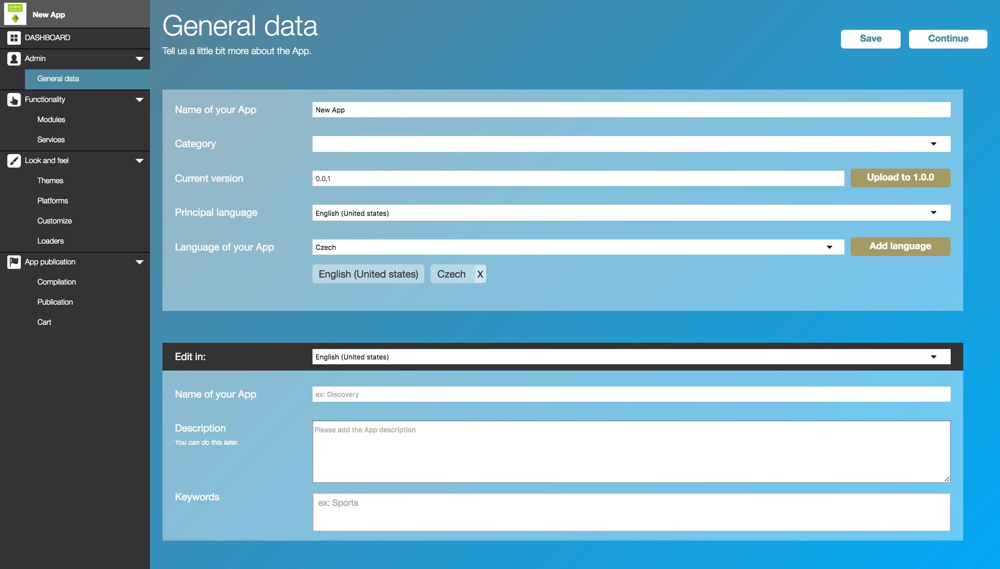
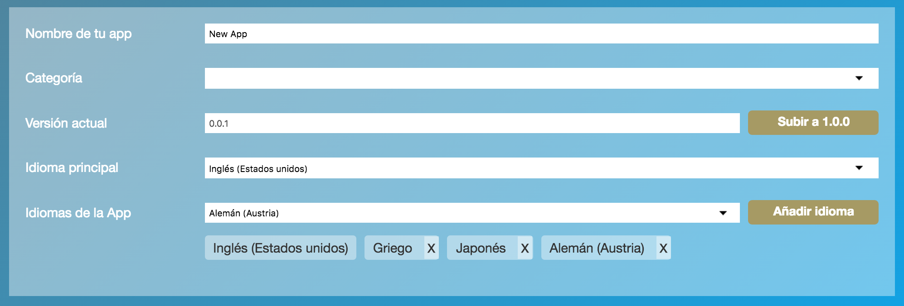
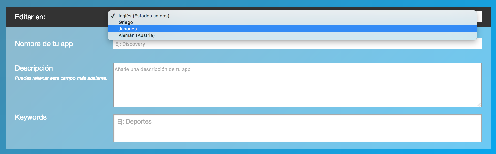

# Administración

Desde esta sección podremos definir toda la información general de nuestra App.

### Datos Clave

En esta parte determinaremos la información técnica.

Recuerda que esta información no varia aunque la App se construya en diversos idiomas.

**Campos:**

- Nombre de tu app

*Este es el nombre de tu App y es el que se usará internamente en Google Play, Apple Store y en nuestro portal. Este nombre es especifico y puede ser diferente al que la aplicación finalmente muestra al usuario (traducciones)*

- Categoría

*Elige una categoría en la que pueda ubicarse tu aplicación. Más adelante podrás seleccionar palabras clave (Keywords) que permitan perfilar aún más tu aplicación*

- Versión actual

*Define el número de versión en la que ese encuentra actualmente tu aplicación, muchos desarrolladores siguen las directrices del [versionamiento semántico](http://semver.org/lang/es/), nosotros también te lo recomendamos.*

- Idioma principal

*Define el idioma principal, solo puede ser uno.*

- Idiomas de la App

*Desde aquí puedes añadir y eliminar tantos idiomas quieras. Definir los idiomas en este punto te ayudará a estructurar tu trabajo, ya que posteriormente deberás rellenar todos los detalles de la App en los idiomas que selecciones*

### Datos Importantes en varios idiomas

En esta parte podremos definir como se vera nuestras aplicaciones directamente a ojos de los usuarios en sus diversos idiomas.

**Campos:**

- Editar en

*Deberemos rellenar los campos por el idioma seleccionado y guardar los cambios. Posteriormente repetiremos el proceso con el resto de idiomas de la lista.*

- Nombre de tu app

*En este caso introduciremos el nombre de la app para ese idioma en concreto. Puede ser diferente al que introducimos previamente (en datos clave)*

- Descripción

*Si aún no estas preparado para rellenar este campo, puedes dejarlo para más adelante, pero recuerda que es importante para posicionar tu App en el mercado.*

- Keywords

*Palabras clave*

**Consejo:** Recuerda que si tu App se orienta a mercados en diversos paises desde aquí podrás configurar y ajustar los metadatos para cada idioma en concreto.
