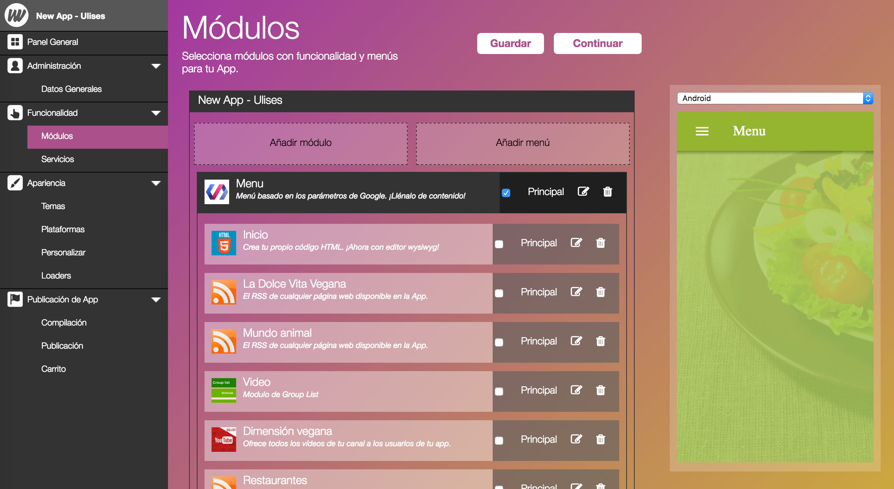
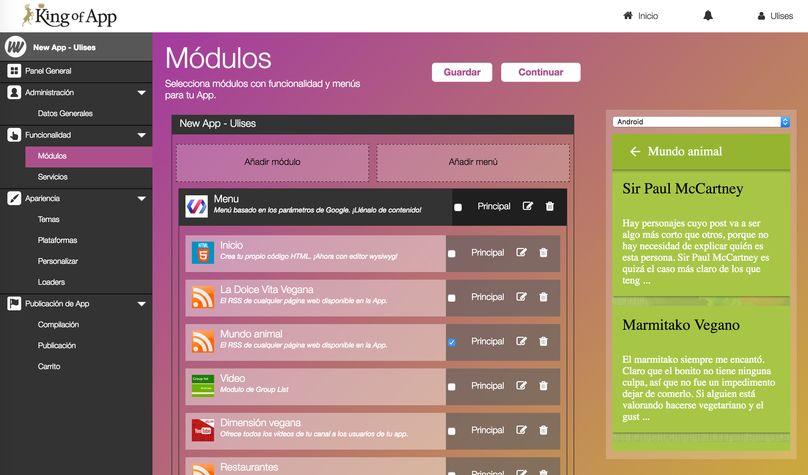
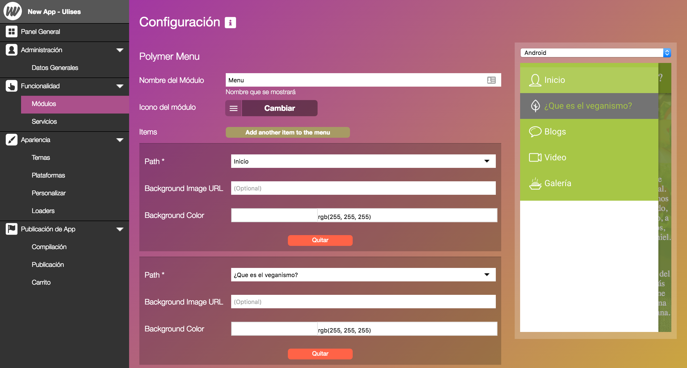
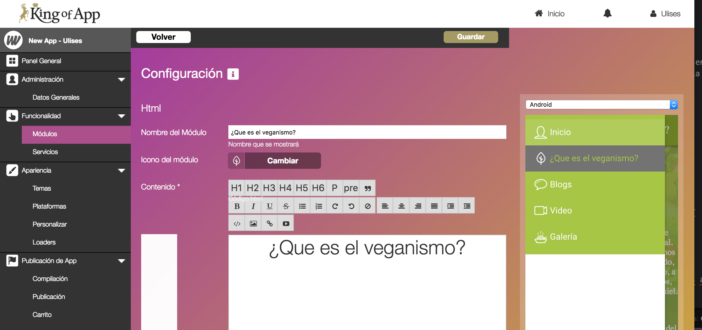

# Módulos (Conceptos Avanzados)

A continuación vamos a explicar algunas propiedades avanzadas de los módulos.

### Principal, la clave de la visualización

**Valores por defecto**

El módulo principal es aquel que se verá cuando inicie la aplicación. Es el equivalente del *index* o *home* en las páginas web.

El visualizador siempre necesita tener un módulo seleccionado como *principal*. El usuario puede determinar que elemento será el principal, en caso de no hacerlo... el propio visualizador decidirá. Además no puede haber más de un módulo principal, en caso de seleccionar otra previamente selecciona perderá la propiedad.

Puede ocurrir que nuestra App sea compleja y necesite diversos módulos entre ellos un menú. Cuando utilizamos un menú y queremos mostrar además un elemento principal deberemos posicionar el módulo dentro del area del menú y seleccionarlo como elemento principal.

De esta forma logramos que el menú y el módulo seleccionado se visualicen como elementos principales.

### Modulos contenedores

Cuando añadimos un nuevo módulo a nuestra aplicación podemos observar que puede tener dos formas:   

  1. claro y sin hueco para añadir más módulos dentro, u
  2. oscuro y con una zona delimitada para arrastrar otros módulos.

El segundo tipo es el que llamamos módulo contenedor. Permite enriquecer tanto el aspecto como la funcionalidad de cada uno de los módulos que hay dentro.

Un buen ejemplo de como funcionan estos módulos son los menús. Permite utilizar el propio menú en cada una de las vistas de los módulos incluidos dentro. Esto no significa que un módulo contenedor pueda mostrar varios de los módulos que contiene a la vez.

Por ejemplo, si tuviésemos un módulo menú y dos módulos html dentro, podríamos navegar por el menú en la vista de cada uno de los menús pero no podríamos ver ambos módulos html de forma simultánea.

**Consejo:** Puedes poner tantos módulos contenedores unos dentro de otros como quieras, esto te permitirá tener funcionalidades más complejas.

### Organización de los menús

La configuración de los elementos que se mostrarán en el menú, su disposición, nombres e iconos se basa en la combinación de varios ajustes.

**Las rutas del menú**

Se deciden dentro de los ajustes del menú.

**Iconos y nombres**

Se deciden dentro de los ajustes de cada módulo por individual

**Consejo:** Si trabajas ordenadamente es más fácil montar tu App. Siempre es más sencillo trabajar cada módulo por separado y luego construir el menú que los agrupe a todos de una manera atractiva para tus usuarios.
