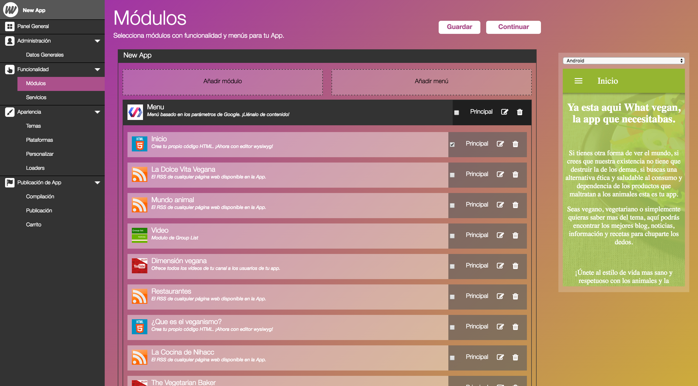
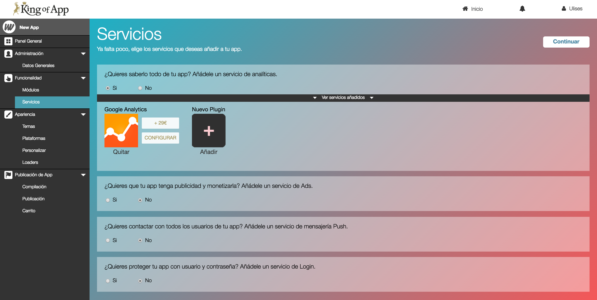

# Funcionalidad

La funcionalidad de tu App se divide en dos categorías (módulos y servicios). 

Módulos y servicios funcionan de manera independiente, cada servicio o módulo tiene funcionalidad por si mismo.

Al seguir una filosofía de modularización en king Of App, añadir nuevas funcionalidades a tu App es tan sencillo como buscar el módulo o servicio que cubra tus necesidades y añadirlo, igual que añadir plugins en un CMS como Wordpress. 

Es importante recordar que muchos de los módulos y servicios requieren de una configuración adicional. Esta configuración varia en función de la naturaleza del módulo o servicio. En ciertos casos se realizaran configuraciones en páginas externas como redes sociales para obtener Tokens, ApiKeys, etc... en otros casos la configuración es interna y no es necesario salir de nuestro Builder.

Los módulos y servicios que están disponibles de manera pública han sido desarrollados por nuestro equipo o desarrolladores certificados de la comunidad, esto garantiza la calidad y fiabilidad del módulo o servicio. Tanto si eres desarrollador certificado como si no siempre podrás tener tus servicios y módulos alojados de manera privada.

Independientemente que los módulos o servicios sean de pago o gratuitos cada uno tiene su propia documentación que te ayudará a utilizar y configurar correctamente la funcionalidad deseada para tu App.

### Detalles

- **[Módulos](modules/readme.md)**
- **[Servicios](services/readme.md)**

**Consejo:** Para ciertas funcionalidades como los menús existen diversos módulos. ¡Prueba y experimenta! hasta que encuentres el que más te gusta.
