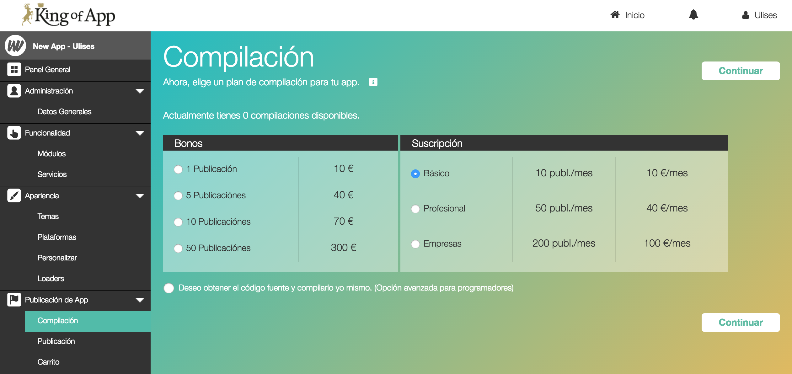
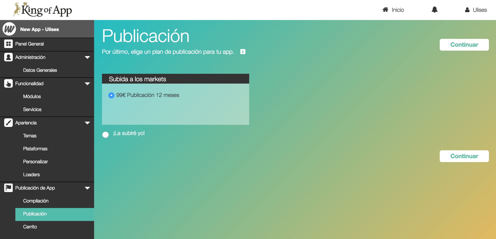
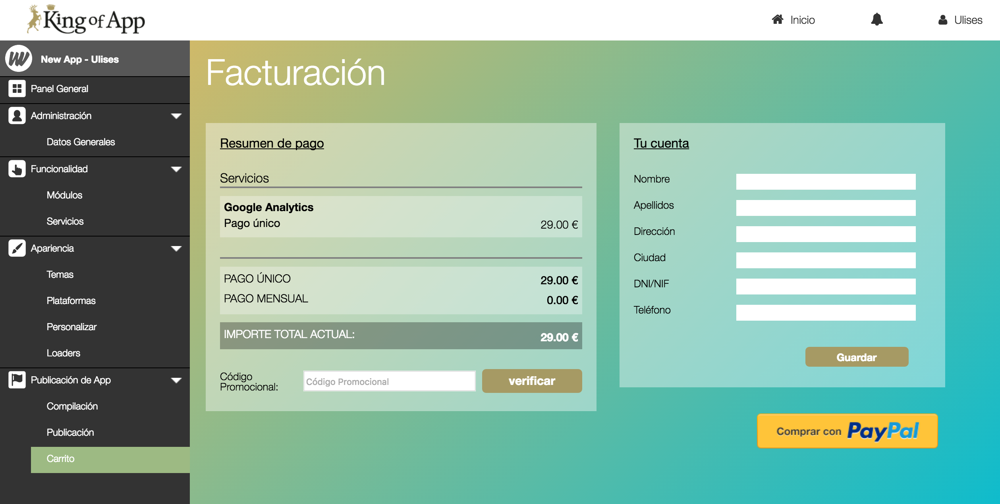

# Publica tu App

### Compilación

Uno de los pasos más críticos para tener una App desplegada es compilar todo el código fuente para que pueda ser subido a los diferentes mercados.

La compilación es una tarea complicada que podemos hacer por ti si lo deseas.

Incluso si tienes pensado crear varias aplicaciones tenemos diversos planes y bonos disponibles.

### Publicación

Publicar una App en Google Play o Apple Store no es una tarea grata ni sencilla. Entre otros requisitos los desarrolladores necesitan tener licencias que les habiliten para poder subir sus Apps.

En King Of App hemos decidido asumir esta pesada carga por ti. Gracias a la suscripción anual podremos mantener tu App en los mercados sin que tengas que preocuparte por nada.

Por supuesto si deseas hacerlo tu mismo, también tienes esa opción. Descargandote tu App y subiendola tu mismo.

### Carrito

Si has adquirido algún elemento premium, ya sea una plantilla, módulos o servicios puedes pagar utilizando Paypal. Es necesario facilitar también los datos fiscales para que te enviemos la factura correspondiente.
