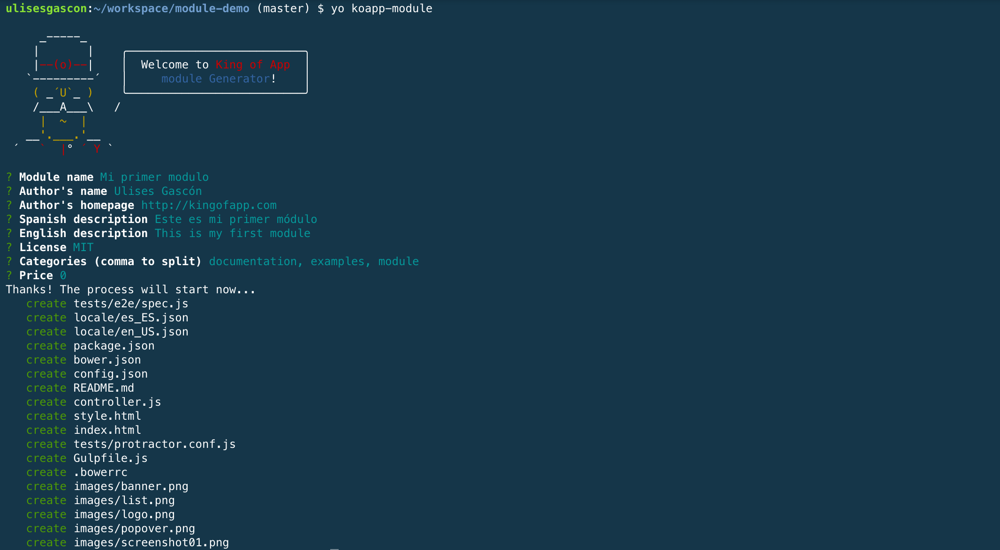

# Módulos

Los módulos permiten crear nuevas funcionalidades, para facilitar el desarrollo de nuevos módulos por parte de la comunidad. Utilizamos como base de trabajo Angular 1.5.x.

Si ya estas familiarizado con el desarrollo de módulos en Angular, no necesitaras aprender nada nuevo, solo tendrás que familiarizarte con la estructura de archivos y la carga dinámica.


Para aquellos desarrolladores que no se hayan aventurado todavía con el desarrollo web con Angular... hemos preparado una [pequeña guía]() de ayuda para hacerte el camino del aprendizaje más fácil, centrándonos solamente en aquellas partes de Angular.js que resultan relevantes para desarrollar Apps con nosotros.


### Generador de Módulos.

Una manera fácil y sencilla para crear módulos rápidamente es utilizar [nuestro generador](https://www.npmjs.com/package/generator-koapp-modules). Este generador se basa en [Yeoman](http://yeoman.io/) al igual que otros generadores que utilizamos en King of App.

Este generador nos permite crear toda la estructura de archivos y contenido que necesitamos para empezar a desarrollar las nuevas funcionalidades.

Una vez tenemos el generador instalado globalmente podremos crear módulos desde cualquier lugar de nuestro sistema, aunque lo recomendado es hacerlo desde la carpeta donde esta alojado el Visualizer.


- **Instalación global y arranque**

```bash
npm install -g generator-koapp-module && yo koapp-module
```

- **Rellenamos los datos necesarios...**





Las preguntas son sencillas y autocompletarán toda la estructura de archivos necesaria para crear un módulo. Solo necesitas editar los archivos *config.json*, *controller.js*, *index.html*, etc... Puedes encontrar comentarios que te ayudaran a ubicarte mejor dentro de cada archivo, además de documentación específica.


### Estructura

Esta es la estructura básica de un módulo. El módulo tiene una estructura similar a otros elementos (spinners, temas, etc...) y requiere de su carpeta con los diversos archivos de configuración.

El módulo ya incluye diversos elementos para facilitarnos el desarrollo como un ejemplo de soporte multi-idiomas y diversas tareas preconfiguradas en Gulp para poder ejecutar test E2E.

```
testmodule
├── tests
│   ├── protractor.conf.js
│   │   └── e2e
│   │       └── spec.js
├── locale
│   ├── en_US.json
│   └── es_ES.json
├── .bowerrc
├── controller.js
├── index.html
├── style.html
├── package.json
├── config.json
├── bower.json
├── Gulpfile.js
└── README.md
```

### Incluyendo el módulo en Koapp Visualizer

Para añadir nuestros módulos a la aplicación deben registrarse dentro del archivo [structure.json](../objects/structure.json.md).

Debemos indicar diversos parámetros, estos  parámetros determinarán y definirán la relación entre nuestros módulo y el Visualizer.

Nota: Es importante utilizar nombres que tengan sentido y respeten la misma filosofía que la declaración de variables (minúsculas, sin acentos, etc...)

- **config.json básico**
```json
{
  //...
  "modules": {
    //...
    "/ruta-mapa": {
      "name": "Mapas",
      "identifier": "googlemap",
      "type": "A",
      "icon": "room",
      "showOn": {
        "market": true,
        "dragDrop": true
      },
      "view": "modules/googlemap/index.html",
      "files": ["modules/googlemap/controller.js", "modules/googlemap/directive.js", "modules/googlemap/style.css"],
      "libs": [{
        "bower": {
          "GoogleWebComponents/google-map": "^1.1.7"
        },
        "src": "bower_components/google-map/google-map.html"
      }],
      "scope": {
        "lat": "39.8847281",
        "lon": "4.2540999",
        "zoom": "15"
      }
    },
    //...
  }
  //...
}
```

### Configuración del Módulo

El propio módulo tiene un archivo de configuración que determinará trabajar en dos areas:

* Configurar aspectos técnicos del módulo, como puede ser definir los ficheros a utilizar, dependencias, variables, etc, y
* Definir todos los metadatos necesarios (autor, precio, versión, descripciones, etc) para poder ubicar correctamente tu módulo en nuestro market una vez haya sido validado y publicado.

Para ver en detalle cada uno de los parámetros de configuración del modulo visita la sección [Module object](../objects/module-object.md).


- **config.json**

```json
{
  "name"       : "Test module",
  "identifier" : "testmodule",
  "icon"       : "home",
  "description": {
    "es-ES": "Descripción del modulo",
    "en-US": "Module description"
  },
  "documentation": {
    "es-ES": "# Test module\r\nConfiguración...",
    "en-US": "# Test module\r\nConfiguration..."
  },
  "descriptionShort": {
    "es-ES": "Descripción corta",
    "en-US": "Short description"
  },
  "price"       : 0,
  "type"       : "A",
  "version"    : "1.0",
  "author"     : "King of App",
  "category"   : [
      "others"
  ],
  "requires"   : [
      "othermodule"
  ],
  "canContain" : false,
  "showOn"     : {
    "market"   : "true",
    "dragDrop" : "true"
  },
  "view"       : "modules/testmodule/index.html",
  "files"      : [
    "modules/testmodule/controller.js"
  ],
  "libs"       : [],
  "deps"       : [],
  "scope"      : {
    "data"  : "Sample data"
  },
  "config"     : [],
  "images": {
    "list": "modules/testmodule/images/list.png",
    "screenshots": [
      "modules/testmodule/images/screenshot01.png",
      "modules/testmodule/images/screenshot02.png"
    ],
    "popover": "modules/testmodule/images/popover.png",
    "banner": "modules/testmodule/images/banner.png",
    "logo": "modules/testmodule/images/logo.png"
  }
}
```

- **Opciones básicas**

Clave | Descripción | Valor por defecto
----------------|-------------|--------
`name` | Nombre del módulo | ""
`identifier` | El nombre único con el que se registró el módulo y sus ficheros.(Solo están permitidos los caracteres alfabéticos) | ""
`icon` | Icono del módule. Puede ser uno de los iconos de [iron-icons](https://elements.polymer-project.org/bower_components/iron-icons/demo/index.html) o customizado (url) | ""
`description` | Soporta Multi-lenguaje y son los datos que se mostraran como descripción en Koapp Builder | {}
`documentation` | Formato Markdown. Soporta Multi-lenguaje y son los datos que se mostraran como documentación en Koapp Builder | {}
`descriptionShort` | Soporta Multi-lenguaje y son los datos que se mostraran como documentación breve en Koapp Builder | {}
`price` | Precio que se mostrará en Koapp Builder | 0
`type` | Tipo de módulo. Por el momento solo soportado Angular ("A")  | A
`version` | Versión | 0.0.1
`author` | Nombre del autor | ""
`category` | Categorías a las que pertenece el módulo | "others"
`view` | Ruta a la vista principal | "modules/{identifier}/index.html"
`files` | Array de ficheros que cargaran antes que el módulo | []
`libs` | Array de dependencias de Bower requeridas por nuestro módulo | []
`deps` | Array de dependencias con Phonegap. | []
`scope` | Objeto que inyecta los valores por defecto al scope del módulo `$scope.{identificador_del_módulo}.modulescope` | {}
`config` | Configuración de los ajustes en Koapp Builder | {}
`images.list` | Imagen utilizada modo lista del Koapp Builder | ""
`images.screenshots` | Capturas de pantalla de nuestro módulo en funcionamiento | {}
`images.popover` | Nuestro Popover | ""
`images.banner` | Nuestro Banner | ""
`images.logo` | Nuestro Logo | ""


- **Opciones avanzadas**

Clave | Descripción | Valor por defecto
----------------|-------------|--------
`showOn.market` | Define si el módulo puede ser utilizado por los usuarios del market | true
`showOn.dragDrop` | Desabilita la funcionalidad *drag&drop* en el market. | True
`requires` | Array de módulos de los que depende nuestro propio módulo  | []
`canContain` | Define si nuestro módulo puede soportar otros módulos dentro de si mismo, como los menús | False
`searchable` | Define si nuestro módulo soporta al módulo de búsqueda. | False

### Estructura interna

Una vez tenemos toda la estructura de archivos y configuración correctamente implementados... podemos centrarnos en la funcionalidad de nuestro módulo.


Toda la lógica de nuestro módulo se define desde *controller.js*. Ya disponemos de una estructura básica con las dependencias mínimas.

- *controller.js*
```javascript
(function() {
  'use strict';

  angular
    .module('miModulo', [])
    .controller('miModuloController', loadFunction);

  loadFunction.$inject = ['$scope', 'structureService', '$location'];

  function loadFunction($scope, structureService, $location) {
    // Register upper level modules
    structureService.registerModule($location, $scope, 'miModulo');
    // --- Start miModuloController content ---
    console.info("Hi! from miModuloController");
    // --- End miModuloController content ---
  }
}());
```


La representación visual de nuestro módulo se define en *index.html*.

- *index.html*
```html
<div class="module miModulo" ng-controller="miModuloController">
    <!-- write your module html here -->
    <p id="hi" translate>miModulo.hi</p>
    <!-- end module html -->
</div>
```

Importante: Presenting data in modules
For templating features to work with modules we strongly recommend to use our custom [Koa elements](https://github.com/KingofApp/docs/tree/master/themes#list-of-elements) inside the view.html of the module.


Nuestros estilos se definen directamente dentro de *style.html*

- *style.html*
```html
<style is="custom-style">
/* write your module style here */
    #hi {
        /* use theme colors @example*/
        color: var(--primary-text-color);
    }
/* end module style */
</style>
```

Importante: Debes hacer uso de las variables de color para que tu módulo sea compatible con todos los temas, así el usuario final define globalmente los estilos en un solo lugar.


### [API (structureService)](structureservice.md)

Los módulos tienen acceso a una API con funciones preparadas para acceder o alterar estructuras de datos de la aplicación.

**[Leer más](structureservice.md)**


### [Funcionalidades de los módulos](features.md)

Los módulos cuentan con algunas funcionalidades pre-cargadas de las que podemos sacar partido como son los eventos o el sistema de almacenamiento.

**[Leer más](features.md)**


### [Interacción con el Usuario](interaction.md)

Cuando desarrollamos nuevas funcionalidades a trevés de módulos siempre tendremos algunos que solicitarle al usuario algunos datos (Tokens, preferencias, etc...) para poder adecuar nuestro módulo al contexto de ejecucción.

Esta Interacción con el usuario se define en forma de formulario desde el Visualizer.

Para agilizar este proceso King of App integró y desarrollo mejoras sobre Angular-Formly

**[Leer más](interaction.md)**

### [Librerías en módulos](libs.md)

Los módulos a menudo necesitaran utilizar librerias de terceros como pueden ser:
* Libreria momentJs para lidiar con formatos de fechas.
* Servicio firebase para conectar con un backend.

Para simplificar el proceso de integración, hemos incluido estas necesidades en nuestra estructura de datos.

**[Leer más](libs.md)**


### [Dependencias en módulos](deps.md)

La complejidad de los módulos irá incrementando y surgira la necesidad de acceder a características concretas de nuestro dispositivo como pueden ser:
* Camara
* Sistema de ficheros
* Acelerómetro

Para tener acceso a estas carácteristicas habrá que utilizar la estructura de datos para agregar las dependencias de cordova.

**[Leer más](deps.md)**


### [Módulos contenedor](container.md)

Los módulos contenedor ofrecen la posibilidad de contener a otros módulos dentro.

Estos suelen ser módulos utilizados para crear estructuras complejas combinando diferentes funcionalidades, por ejemplo: Una vista compuesta de un slider con un feed de facebook.

**[Leer más](container.md)**

### [Menús](menus.md)

Un tipo especial de módulos son los menús.

Los menús pueden desarrollarse con Angular o Polymer, en función de tus necesidades.

Además los menús tienen la particularidad de actuar como padres de otros módulos.

**[Leer más](menus.md)**


### [Testing con módulos](testing.md)

El testeo de nuestro código juega un papel crucial para preveenir errores.

En King of App recomendamos realizar al menos test de integración (e2e).

El [generador de Módulos](https://www.npmjs.com/package/generator-koapp-module) ya incluye ejemplos.

**[Leer más](testing.md)**

### [Widgets para módulos](widget.md)

Los módulos de King of App pueden registrar widgets en el Builder para tareas de administración en módulos que utilicen contenidos de terceros.

Como puede ser un modulo de lista de contactos donde esta sección se utilizara para introducir los datos que posteriormente listará el módulo.

Los módulos también tienen la opción de asistir al usuario con la configuración, para ello se ha habilitado un nuevo elemento de formly `autoconfig`.
**[Leer más](widget.md)**

### Ejemplo

- **[Módulo OpenweatherMap](https://github.com/KingofApp/koapp-module-openweathermap)**


Este módulo utiliza las diversas librerías para lograr integrar la información meteorológica de una zona concreta.

- Licencia: MIT.
- [Código fuente](https://github.com/KingofApp/koapp-module-openweathermap)


### Más Ejemplos

- **[Módule Sencillo helloworld](https://github.com/KingofApp/koapp-module-helloworld)**
