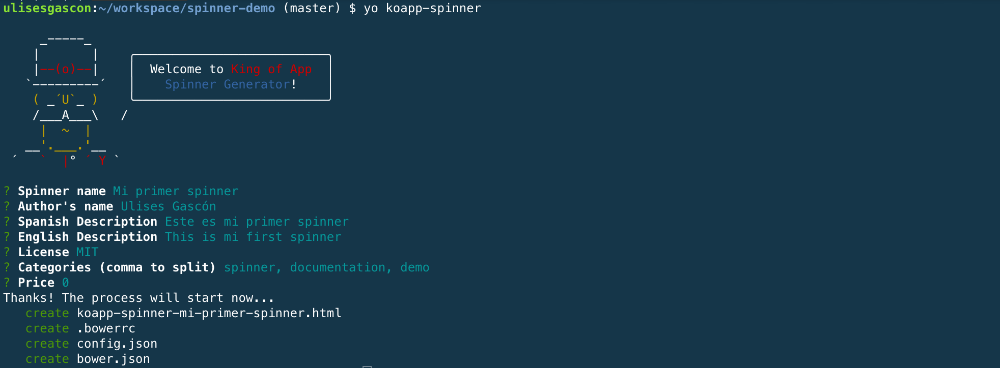

# Spinners (Loaders)

Los spinners se construyen con Polymer, como un elemento más.


### Generador de Spinners.

Una manera fácil y sencilla para crear spinners es utilizar [nuestro generador](https://www.npmjs.com/package/generator-koapp-spinner). Este generador se basa en [Yeoman](http://yeoman.io/) al igual que otros generadores que utilizamos en King of App. Una vez tenemos el generador instalado globalmente podremos crear spinners desde cualquier lugar de nuestro sistema, aunque lo recomendado es hacerlo desde la carpeta donde esta alojado el Visualizer.


- **Instalación global y arranque**

```bash
npm install -g generator-koapp-spinner && yo koapp-spinner
```

- **Rellenamos los datos necesarios...**





Las preguntas son sencillas y autocompletarán toda la estructura de elementos de Polymer necesaria para crear un spinner. Solo necesitas editar el archivo *html* e incluir tus estilos (css) y estructura (html). Puedes encontrar comentarios que te ayudaran a ubicarte mejor dentro del archivo.


### Estructura

Se trabaja como un elemento y requiere de su carpeta con los diversos archivos de configuración.

```
koapp-spinner-template
├── .bowerrc
├── bower.json
├── config.json
└── koapp-spinner-template.html
```

### Incluyendo el Spinner en nuestra App

Los spinners también están registrados dentro de nuestro archivo `structure.json`. Debemos indicar ruta e identificador... estos dos parámetros determinarán y definirán la relación entre muchos elementos. Es importante utilizar nombres que tengan sentido y respeten la misma filosofía que la declaración de variables (minúsculas, sin acentos, etc...)

```json
{
  //...
  "config": {
    //...
    "spinner": {
      "identifier": "koapp-spinner-template",
      "path": "spinners/koapp-spinner-rotationplane/koapp-spinner-template.html"
    },
    //...
  }
  //...
}
```

### Configurando el Spinner

El propio spinner tiene un archivo de configuración que determinará ciertos aspectos técnicos y también nos aportará todos los metadatos necesarios (autor, precio, versión, descripciones, etc...) para poder ubicar correctamente tu spinner en nuestro market una vez haya sido validado y publicado.


- **config.json básico**

```json
{
  "name": "Spinner Template",
  "identifier": "koapp-spinner-template",
  "description": {
    "en-US" : "",
    "es-ES" : ""
  },
  "version": "0.0.1",
  "author": "King of App",
  "category": [],
  "price": 0,
  "showOn": {
    "market": true
  },
  "main": "spinners/koapp-spinner-template/koapp-spinner-template.html"
}
```

- **Explicación**

Clave | Descripción | Valor por defecto
----------------|-------------|--------
`name` | Nombre del spinner | ""
`identifier` | El nombre único con el que se registrará el spinner y sus ficheros.(Solo estan permitidos los caracteres alfabéticos) | ""
`description` | Descripción multilenguaje que mostraremos en nuestro market | {}
`version` | Control de versiones. [Ver SemVer](http://semver.org/lang/es/) | 0.0.1
`author` | Nombre del autor | ""
`category` | Categorias a las que pertenece tu spinner  | []
`price` | Precio para adquirir tu spinner en nuestro market | 0
`showOn.market` | Define si el spinner puede ser utilizado por los usuarios. | True
`main` | ruta/url al spinner | "spinners/koapp-spinner-{identifier}/koapp-spinner-{identifier}.html"

### Dependéncias del spinner

- `.bowerrc`. Asegurate que se posiciona en la ruta correcta, esta es la configuración recomendada.

```json
{
  "directory" : "../../bower_components"
}
```

- `bower.json`. Esta es la configuración recomendada (polymer, koa-behaviors y devDependencies incluidos), pero puedes ampliarla si lo necesitas.

```json

{
  ...
  "dependencies": {
    "polymer": "Polymer/polymer#^1.2.0",
    "koa-behaviors": "KingofApp/koa-behaviors#^0.11.0"
  },
  "devDependencies": {
    "webcomponentsjs": "webcomponents/webcomponentsjs#^0.7.0"
  }
}
```


### Estructura interna del spinner

- koapp-spinner-template.html
```html
<link rel="import" href="../../bower_components/polymer/polymer.html">
<link rel="import" href="../../bower_components/koa-behaviors/koa-spinner-behavior.html">

<dom-module id="koapp-spinner-template">
  <template strip-whitespace>
    <style>
      /* CSS del spinner */

      /* fin CSS */
    </style>

    <!-- HTML del spinner -->

    <!-- fin HTML -->
  </template>

  <script>
    Polymer({
      is: 'koapp-spinner-template',
      behaviors: [
        Polymer.KoaSpinnerBehavior
      ]
    });
  </script>
</dom-module>
```

### Combinaciones de colores

Al igual que en los temas, podremos utilizar algunas variables clave para hacer que nuestro spinner se adapte automáticamente a los colores que los usuarios quieran.

- **Colores disponibles**

Propiedad del color | Descripción
----------------|-------------
`--primary-text-color` | El color del texto principal se utiliza como un color de texto general.
`--primary-background-color` | El color de fondo se utiliza en items, cards, dialogs, drop-downs o menus.
`--secondary-text-color` | Se utiliza en cualquier texto que no muestre una información primaria.
`--disabled-text-color` | Este color de texto se utiliza para mostrar las opciones de movilidad reducida.
`--divider-color` | Se utiliza en divisores como en las tarjetas
`--primary-color` | El color más utilizado en tu App.
`--light-primary-color` | Versión modificada del color primario para resaltar.
`--dark-primary-color` | Versión modificada del color primario para crear sombras.
`--accent-color` | Color de alto contraste, debe ser diferente del color primario, color del texto o color de fondo .
`--light-accent-color` | Versión modificada del color de acentuado para resaltar.
`--dark-accent-color` | Versión modificada del color de acentuado para crear sombras.
`--background-color` | COlor utilizado para el fondo.

- **Ejemplo**:
```css
.spinner-layer {
  position: absolute;
  width: 100%;
  height: 100%;
  opacity: 0;
  border-color: var(--accent-color);
}
```

- **Más información**
  - [Polymer - Styling local DOM](https://www.polymer-project.org/1.0/docs/devguide/styling)
  - [Using CSS variables](https://developer.mozilla.org/en-US/docs/Web/CSS/Using_CSS_variables)

### Visualización del Spinner

En ocasiones necesitamos poder ver el spinner en funcionamiento de manera ininterrumpida, existen diversos métodos para lograrlo.

La opción más recomendada es crearte un módulo que incluya en el `index.html` y `controller.js` la siguiente configuración.

- index.html
```
<div class='transitionloader'></div>
```

- controller.js
```
structureService.launchSpinner('.transitionloader');
```

También puedes descargarlo [desde aquí]().  

Pero si solo vas a diseñar un spinner o no quieres emplear tiempo en crearte un entorno de trabajo puedes optar por modificar el módulo html que se instala por defecto junto al Visualizer


### Ejemplo sencillo

Para este ejemplo utilizaremos como base [el spinner de W3Schools](http://www.w3schools.com/howto/howto_css_loader.asp). Este spinner es muy sencillo y solamente tendremos que preocuparnos de incluir el HTML y el CSS en nuestra App.


**Puedes ver el ejemplo completo en este [Gist](https://gist.github.com/UlisesGascon/8da33d599689ea5911daee5a5edc409e)**

**Detalles de la integración**
- app/core/structure.json

```json
//...
"spinner": {
  "identifier": "koapp-spinner-doc-simple",
  "path": "spinners/koapp-spinner-doc-simple/koapp-spinner-doc-simple.html"
},
//...
```

- bower.json

```json
{
  "name": "koapp-spinner-doc-simple",
  "authors": "Ulises Gascón",
    "description": "Documentation simple sample spinner for King of App",
  "main": "koapp-spinner-doc-simple.html",
  "moduleType": [
    "globals"
  ],
  "keywords": [
    "kingofapp",
    "spinner"
  ],
  "license": "MIT",
  "homepage": "http://kingofapp.com",
  "private": true,
  "ignore": [
    "**/.*",
    "node_modules",
    "bower_components",
    "test",
    "tests"
  ],
  "dependencies": {
    "polymer": "Polymer/polymer#^1.2.0",
    "koa-behaviors": "KingofApp/koa-behaviors#^0.11.0"
  },
  "devDependencies": {
    "webcomponentsjs": "webcomponents/webcomponentsjs#^0.7.0"
  }
}
```

- config.json

```json
{
  "name": "Spinner - simple example",
  "identifier": "koapp-spinner-doc-simple",
  "description": {
    "en-US" : "Documentation sample spinner for King of App",
    "es-ES" : "Ejemplo de la documentación para King of App"
  },
  "version": "0.0.1",
  "author": "Ulises Gascón",
  "category": ["documentation", "demo"],
  "price": 0,
  "platforms": [
    "android",
    "ios",
    "windows"
  ],
  "showOn": {
    "market": true
  },
  "subscription": false,
  "main": "spinners/koapp-spinner-doc-simple/koapp-spinner-doc-simple.html"
}
```

- koapp-spinner-doc-simple.html

```html
<link rel="import" href="../../bower_components/polymer/polymer.html">
<link rel="import" href="../../bower_components/koa-behaviors/koa-spinner-behavior.html">

<dom-module id="koapp-spinner-doc-simple">
  <template strip-whitespace>
    <style>
      /* write your template style here */
        .loader {
            border: 16px solid #f3f3f3;
            border-top: 16px solid #3498db;
            border-radius: 50%;
            width: 120px;
            height: 120px;
            animation: spin 2s linear infinite;
        }

        @keyframes spin {
            0% { transform: rotate(0deg); }
            100% { transform: rotate(360deg); }
        }
      /* end template style */
    </style>

    <!-- write your template here -->
      <div class="loader"></div>
    <!-- end template -->
  </template>

  <script>
    Polymer({
      is: 'koapp-spinner-doc-simple',
      behaviors: [
        Polymer.KoaSpinnerBehavior
      ]
    });
  </script>
</dom-module>
```


### Ejemplo avanzado con canvas

Utilizaremos como base [este spinner](https://codepen.io/ulisesgascon/pen/rrxXXW) que funciona utilizando *canvas*. Este spinner utiliza JavaScript como base junto con HTML y css.  Deberemos incluirlo todo para asegurarnos que funcione correctamente.

La integración de JavaScript se hace sencilla cuando tenemos en cuenta los [Lifecycle callbacks de polymer](https://www.polymer-project.org/1.0/docs/devguide/registering-elements#lifecycle-callbacks), ya que podemos encapsular toda la lógica, que teníamos originalmente, dentro de una función y no necesitaremos retocar el código original.


**Puedes ver el ejemplo completo en este [Gist](https://gist.github.com/UlisesGascon/4ec4724dcaa7b68ec50c4799e6893b69)**

**Detalles de la integración**
- app/core/structure.json

```json
//...
"spinner": {
  "identifier": "koapp-spinner-doc-complex",
  "path": "spinners/koapp-spinner-doc-complex/koapp-spinner-doc-complex.html"
},
//...
```

- bower.json

```json
{
  "name": "koapp-spinner-doc-complex",
  "authors": "Ulises Gascón",
    "description": "Documentation complex sample spinner for King of App",
  "main": "koapp-spinner-doc-complex.html",
  "moduleType": [
    "globals"
  ],
  "keywords": [
    "kingofapp",
    "spinner"
  ],
  "license": "MIT",
  "homepage": "http://kingofapp.com",
  "private": true,
  "ignore": [
    "**/.*",
    "node_modules",
    "bower_components",
    "test",
    "tests"
  ],
  "dependencies": {
    "polymer": "Polymer/polymer#^1.2.0",
    "koa-behaviors": "KingofApp/koa-behaviors#^0.11.0"
  },
  "devDependencies": {
    "webcomponentsjs": "webcomponents/webcomponentsjs#^0.7.0"
  }
}
```

- config.json

```json
{
  "name": "Spinner - Complex example",
  "identifier": "koapp-spinner-doc-complex",
  "description": {
    "en-US" : "Documentation complex sample spinner for King of App",
    "es-ES" : "Ejemplo complejo de la documentación para King of App"
  },
  "version": "0.0.1",
  "author": "Ulises Gascón",
  "category": ["documentation", "demo"],
  "price": 0,
  "platforms": [
    "android",
    "ios",
    "windows"
  ],
  "showOn": {
    "market": true
  },
  "subscription": false,
  "main": "spinners/koapp-spinner-doc-complex/koapp-spinner-doc-complex.html"
}
```

- koapp-spinner-doc-complex.html

```html
<link rel="import" href="../../bower_components/polymer/polymer.html">
<link rel="import" href="../../bower_components/koa-behaviors/koa-spinner-behavior.html">

<dom-module id="koapp-spinner-doc-complex">
  <template strip-whitespace>
    <style>
      /* CSS del spinner */
      #spinner {
        width: 50;
        height: 50;
        padding: 30px;
      }
      /* end CSS */
    </style>

    <!-- HTML del spinner -->
      <canvas id="spinner"></canvas>
    <!-- fin HTML -->
  </template>

  <script>
    Polymer({
      is: 'koapp-spinner-doc-complex',
      // Utilizando lifecycle-callbacks (attached en este caso)
      attached: function() {
          var canvas = document.getElementById('spinner');
          var context = canvas.getContext('2d');
          var start = new Date();
          var lines = 16,  
              cW = context.canvas.width,
              cH = context.canvas.height;
          var draw = function() {
              var rotation = parseInt(((new Date() - start) / 1000) * lines) / lines;
              context.save();
              context.clearRect(0, 0, cW, cH);
              context.translate(cW / 2, cH / 2);
              context.rotate(Math.PI * 2 * rotation);
              for (var i = 0; i < lines; i++) {
                  context.beginPath();
                  context.rotate(Math.PI * 2 / lines);
                  context.moveTo(cW / 10, 0);
                  context.lineTo(cW / 4, 0);
                  context.lineWidth = cW / 30;
                  context.strokeStyle = "rgba(0, 0, 0," + i / lines + ")";
                  context.stroke();
              }
              context.restore();
          };
          window.setInterval(draw, 1000 / 30);
      },
      behaviors: [
        Polymer.KoaSpinnerBehavior
      ]
    });
  </script>
</dom-module>
```
