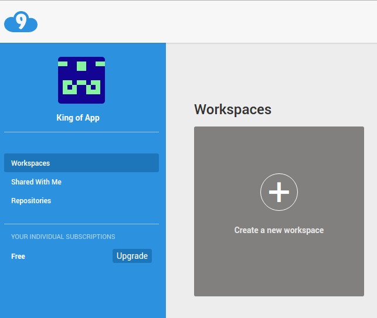
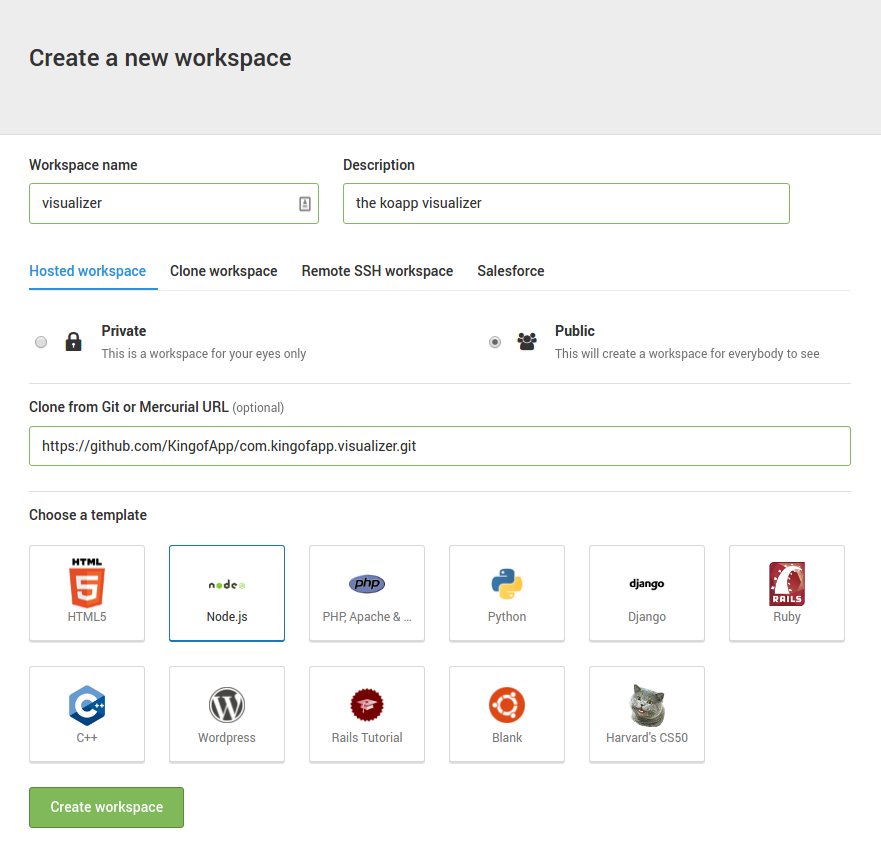
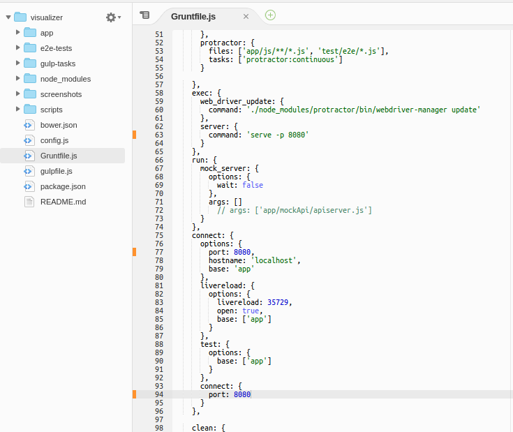
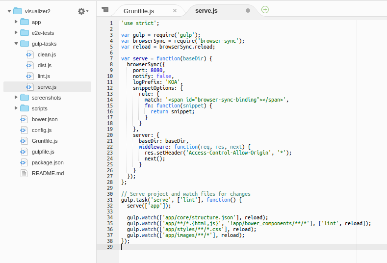
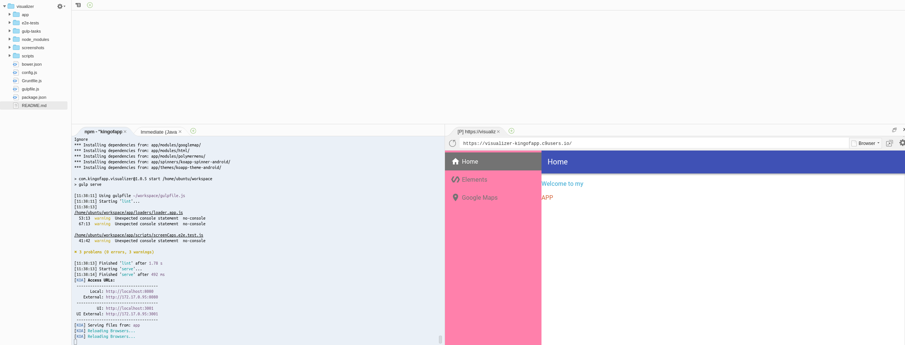

# Instalación de Visualizer en C9.io

Cloud9 nos permite trabajar directamente en la nube. Para ello... c9 nos ofrece maquinas virtuales basadas en Ubuntu.

[Ejemplo de solo lectura de c9 con Vislualizer](https://ide.c9.io/kingofapp/visualizer)


Una vez tengamos una cuenta creada, procedemos a crear un nuevo espacio de trabajo "workspace"





Tenemos dos opciones disponibles para instalarlos Visualizer en un workspace de c9.

- [Instalación automática](#instalaci%C3%B3n-autom%C3%A1tica)

Partiendo de [este script](https://gist.github.com/UlisesGascon/eb476f5a77fee78563bc0302632cd648) instalaremos cómodamente todo lo necesario. Este script realiza de manera automática los pasos de la instalación manual.


- [Instalación manual](#instalaci%C3%B3n-manual)

Es la solución más lenta pero nos permite alterar el proceso de instalación. Este método también esta recomendado en caso de encontrar problemas con las otras alternativas.


### Instalación automática

Solo es necesario ejecutar este comando en la terminal.
```bash
wget https://gist.githubusercontent.com/UlisesGascon/eb476f5a77fee78563bc0302632cd648/raw/6bd94dc1ccff8c04d953802317b4c7ff3a7327ed/visualizer_installer.sh && chmod u+x visualizer_installer.sh && ./visualizer_installer.sh
```


### Instalación manual

**Utilizaremos la siguiente configuración inicial**



Añadiremos clone from Git or Mercurial URL:
https://git@github.com/KingofApp/com.kingofapp.visualizer.git


**Verificamos las versiones de [Node.js](https://nodejs.org/en/) y [Npm](https://www.npmjs.com/)**
- Ejecutar en la terminal
  ```
    node --version && npm --version
  ```

- Esperado (pueden variar las versiones):
  ```
    v4.5.0
    2.15.9
  ```

  **Ajustar Visualizer al entorno de C9.io (puertos)**

  - Sustituir *Grunfile.js* con los datos de *[este archivo](https://gist.github.com/UlisesGascon/54acff02948964554726708f04a25937#file-gruntfile-js)*

  

  - Sustituir *gulp-tasks/serve.js* con los datos de *[este archivo](https://gist.github.com/UlisesGascon/54acff02948964554726708f04a25937#file-serve-js)*

  


    - Ejecutar en la terminal
  ```
    npm start
  ```
  - Abre una nueva pestaña con esta URL: `https://<workspacename>-<username>.c9users.io` o pulsa sobre el boton de prvisualizar

  
