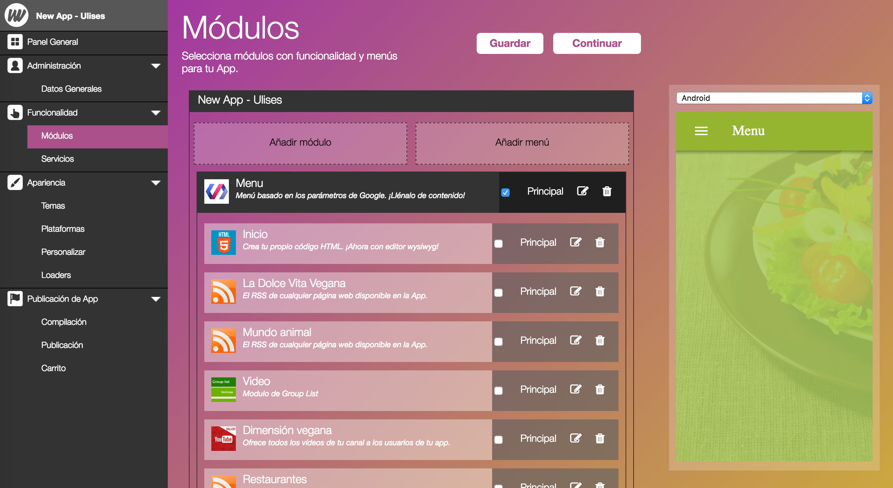
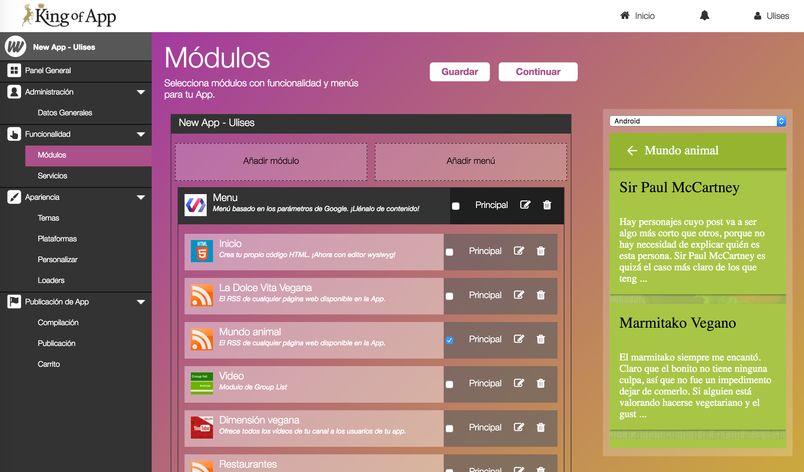
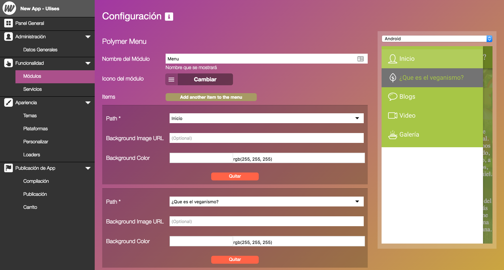
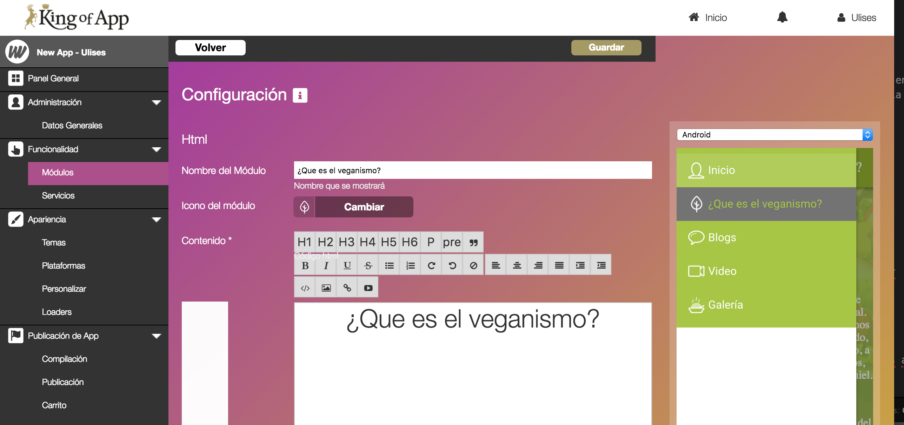

# Módulos (Conceptos Avanzados)

### Principal, la clave de la visualización

**Valores por defecto**

El visualizador siempre necesita tener un módulo seleccionado como *principal*. El usuario puede determinar que elemento será el principal, en caso de no hacerlo... el propio visualizador decidirá.

Este elemento principal determina que módulo se cargará al abrir la aplicación.

Puede ocurrir que nuestra App sea compleja y necesite diversos módulos entre ellos un menú. Cuando utilizamos un menú y queremos mostrar además un elemento principal deberemos posicionar el módulo dentro del area del menú y seleccionarlo como elemento principal.

De esta forma logramos que el menú y el módulo seleccionado se visualicen como elementos principales.

### Organización de los menús

La configuración de los elementos que se mostrarán en el menú, su disposición, nombres e iconos se basa en la combinación de varios ajustes.

**Las rutas del menú**

Se deciden dentro de los ajustes del menú.

**Iconos y nombres**

Se deciden dentro de los ajustes de cada módulo por individual

**Consejo:** Si trabajas ordenadamente es más fácil montar tu App. Siempre es más sencillo trabajar cada módulo por separado y luego construir el menú que los agrupe a todos de una manera atractiva para tus usuarios.
