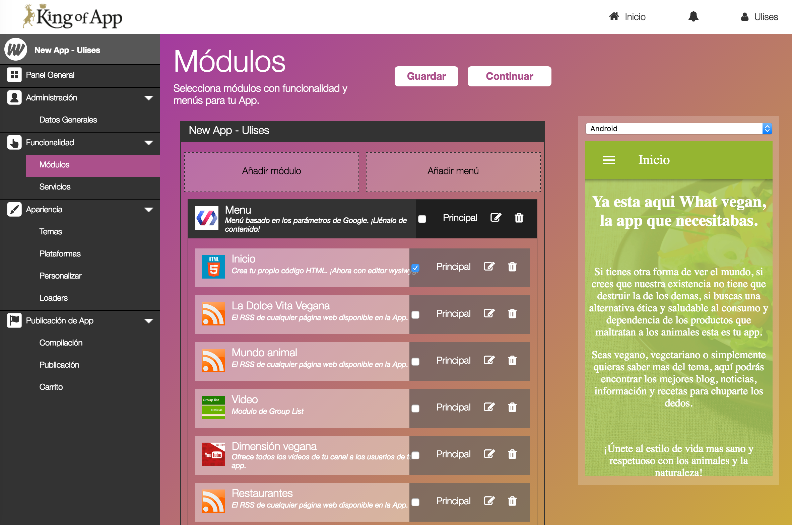
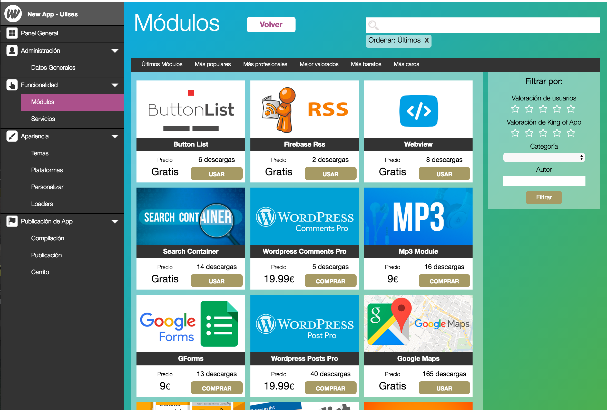
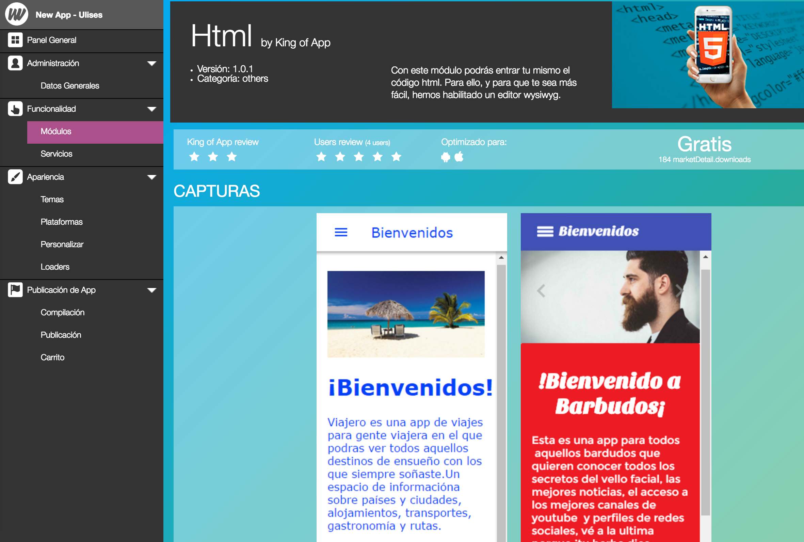
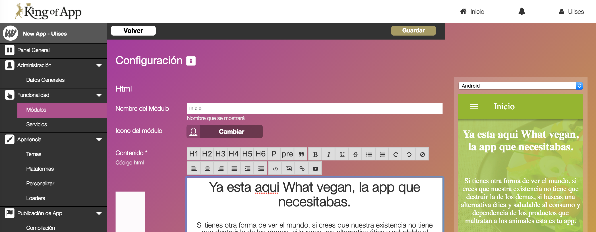

# Módulos

Dentro de la funcionalidad de la App, los módulos juegan un papel clave.

Los módulos son capaces de conectarse a servicios de terceros como Facebook, Flickr, Google Calendar, etc... esto hace que nuestra App pueda beneficiarse de un flujo de trabajo ya existente.

Por ejemplo si quisiéramos incluir un calendario en nuestra App no necesitaríamos más que compartir con nuestra App un calendario ya existente en Google Calendar. Así evitamos tener que mantener por separado el calendario de nuestra empresa y el de nuestra App.

Una App que combina e integra servicios de terceros tiene muchas ventajas a la hora de generar contenido y mantenernos actualizados. Podemos fácilmente incluir noticias de diversas fuentes utilizando los mismo canales RSS que nuestro sistema de suscripción personal. Lo mismo ocurre con Wordpress, si ya estas publicando contenido de manera regular tenemos plugins que traen esas entradas a tu App. ¡Y no solo eso! También podemos integrar los comentarios de nuestros seguidores, mapas, actualizaciones de redes sociales, etc...

Nuestra filosofía se basa en hacerte la vida más fácil. Ya es bastante duro crear contenido novedoso y de calidad para tus seguidores como para tener que replicarlo manualmente y sumarte más trabajo.

Puedes consultar la lista de módulos disponibles pinchando en *Añadir módulo* y empezar a integrar funcionalidades en tu App.

Para ayudar a decidirnos por una módulo u otro podemos utilizar filtros diversos desde valoraciones mínimas, categorías... hasta autor.

Además del filtro tenemos listas que agrupan los módulos por popularidad, profesionalidad, precios, etc...

También disponemos de una lista de módulos y su información relevante [aquí](modules_list.md).

Todos los módulos cuentan con una previsualización interactiva que nos permite evaluar el módulo sin tener que instalarlo.

Ademas podremos revisar las opiniones de otros usuarios y la valoración que han otorgado.

### Conceptos Generales

Todos los plugins comparten ciertas cosas en común que nos ayudan a todos a organizar nuestra App.

- **Nombre del módulo**

    Este campo nos permite definir el nombre con el que se conocerá a nuestro módulo dentro de la aplicación. Los menús utilizarán este nombre también.

- **Icono del módulo**

    Este icono se utilizará para mostrarse junto al nombre del módulo en los menus de nuestra App.

- **Otros**

    Cada módulo tiene una serie de campos adicionales y específicos que sirven para configurar la funcionalidad interna del módulo. Siempre podremos encontrar la documentación al pie del módulo

### Conceptos Avanzados

Los módulos nos permiten crear menús y definir la visualización de los diversos módulos en nuestra App, lo que nos permite generar una mayor interacción con el usuario final, si deseas saber más consulta los [conceptos avanzados](advance_modules.md)

**Consejo:** Recuerda que siempre tienes la documentación del módulo justo después de los campos.
