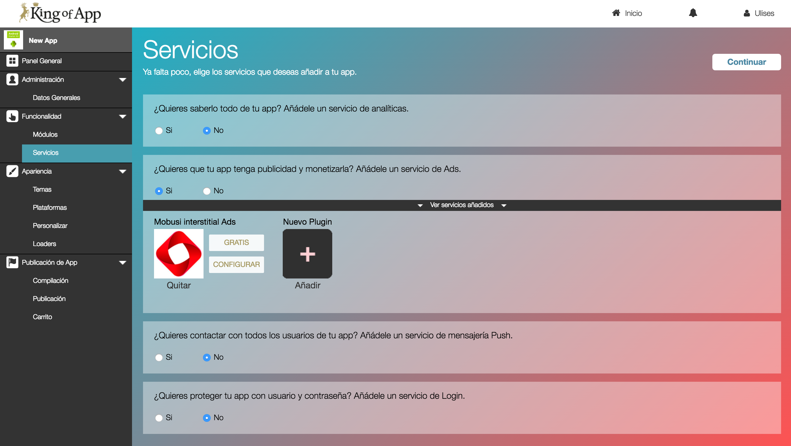

# Servicios

Los módulos permiten extender la funcionalidad de la aplicación hasta un nivel determinado. Cuando requerimos de funcionalidades más complejas es muy habitual que tengamos que centrarnos en el uso de Servicios.

Los servicios nos permiten modificar la funcionalidad a nivel de la App, permitiendo modificar todas las vistas de la App por ejemplo. 

A la hora de manejar los servicios prácticamente dejamos atrás el enfoque visual y nos centraremos en aspectos más orientados a la aplicación en sí como es el la inclusión de servicios de analíticas, login social, publicidad...

Puedes consultar  la lista de servicios y su información relevante [aquí](services_list.md).

La configuración de los servicios es muy similar a los módulos. En la configuración deberemos de incluir datos importantes como los tokens, ApiKeys, etc... también podremos definir que módulos se beneficiaran de nuestros servicio.

**Consejo:** Recuerda que un buen análisis de tus usuarios puede ayudarte a enfocar mejores campañas de marketing y también hará más fácil segmentar.
