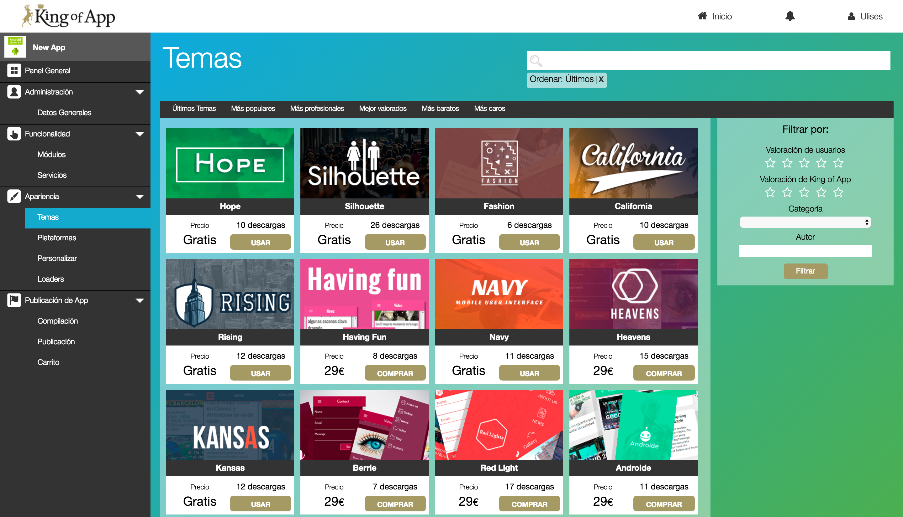
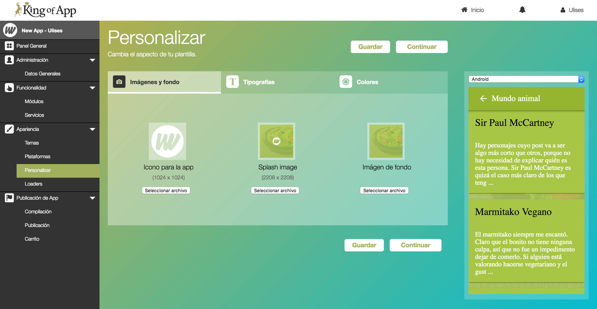
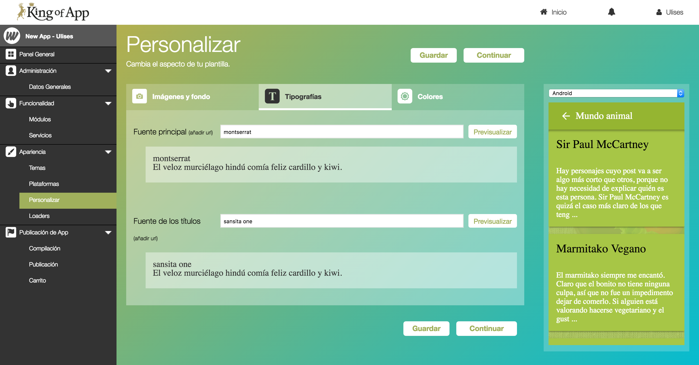
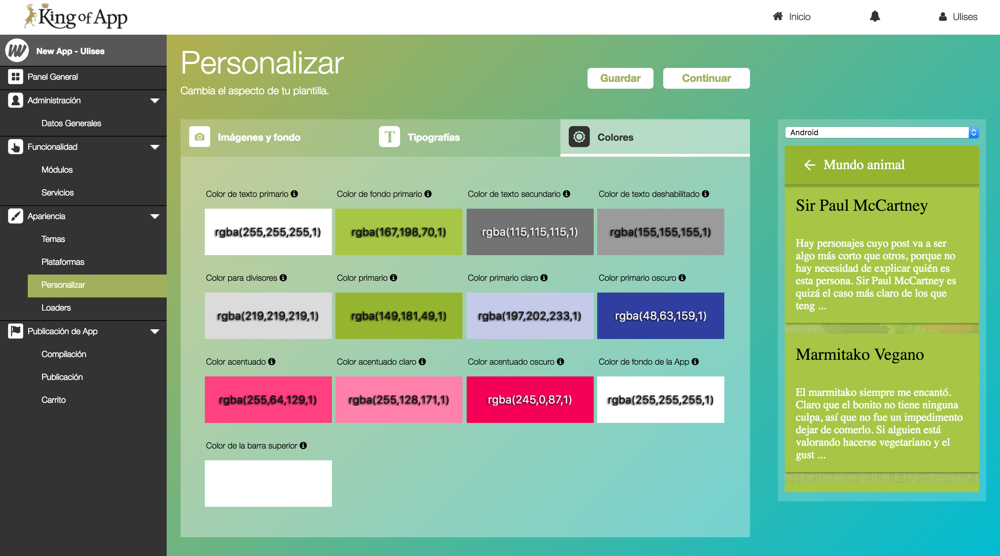
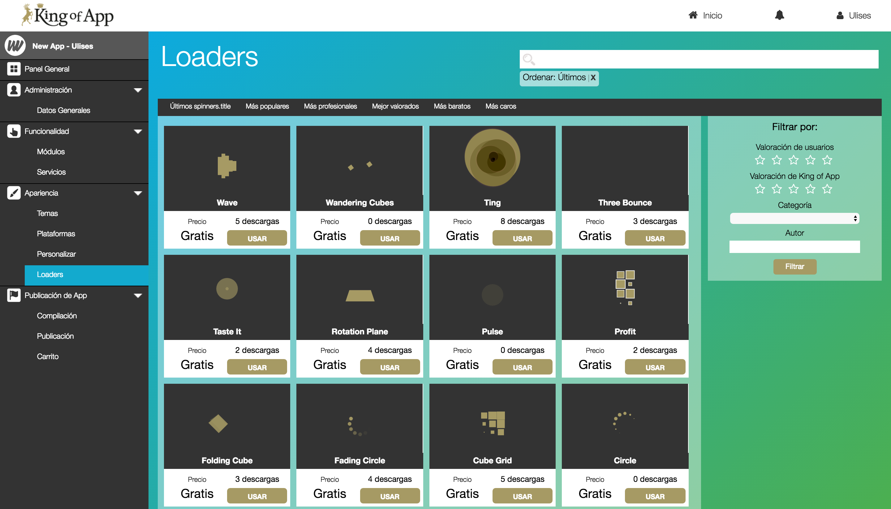

# La apariencia

Además de la funcionalidad, un factor clave para el éxito de nuestra App es su apariencia. Una App intuitiva y visualmente atractiva nos ayudará a fidelizar a nuestros usuarios.

Dentro de la filosofía de King Of App decidimos que la facilidad para crear, modificar, reutilizar el aspecto de nuestras Apps es una prioridad y por ello hemos dividido la apariencia en cuatro secciones.

### Temas

Los temas soportan todo el peso visual de nuestra App y están basados en [Polymer](https://www.polymer-project.org/1.0/). Todos los temas disponibles en nuestro market han sido creado por nuestros desarrolladores o por desarrolladores certificados. Los temas están disponibles en un amplio abanico de precios que van desde gratuitos hasta los 29€

Al igual que con los servicios y módulos cualquiera puede extender y crear sus propios temas pero solo aquellos desarrolladores que estén certificados podrán compartirlos públicamente en nuestro market. Por supuesto puedes tener tantos temas privados como desees, esto puede ayudarte a reducir mucha carga de trabajo.

**Elegir entre tantas opciones**

Sabemos que en ocasiones puede resultar abrumador elegir entre tantos temas, así que te lo ponemos fácil con algunos trucos.

:::::::::  Lista de Temas   ::::::::::
Puedes consultar la [lista de temas](themes_list.md) desde aquí y empezar a probar nuevos aspectos en tu App.

Para ayudar a decidirnos por un tema u otro podemos utilizar filtros diversos desde valoraciones mínimas, categorías... hasta autor.

Además del filtro tenemos listas que agrupan los módulos por popularidad, profesionalidad, precios, etc...

**Adaptar un tema**

El tema es la base sobre la que trabajaremos, posteriormente podemos ajustar los colores y más aspectos generales para adecuar aún el tema a tu proyecto.

### Plataformas

Cuando te decides por un tema no siempre nos encajará como deseamos para plataformas tan distintas como Android o iOS, por eso en King Of App te animamos a que utilices una plantilla por cada plataforma si lo deseas.

### Personalización

La personalización se basa en tres secciones que nos ayudan a acotar el volumen y profundidad de los cambios.

**Imágenes y fondo**

Desde aqui podemos definir:

- Icono para la app

Nos permite determina el icono que se mostrará en los smartphones

- Splash image

Podemos definir la imagen de fondo que se mostrará durante la carga de la aplicación.

- Imagen de fondo

Es la imagen de fondo que se mostrará a lo largo de la aplicación. Muchos desarrolladores utilizan una sola imagen de fondo, puedes aportar más valor a tu imagen splash si le incluyes tu logo.

**Tipografías**

Podemos elegir cualquiera de las aburridas fuentes clásicas (Arial, Times New Roman, etc...) o realmente aprovechar esta funcionalidad eligiendo una fuente que nos represente mejor del catálogo de [Google Fonts](https://fonts.google.com/).

Solo necesitarás introducir el nombre de la fuente deseada y nosotros ponemos la magia. Recuerda que puedes ver los cambios en el previsualizador de la derecha.

**Colores**

Una manera fácil y sencilla de adaptar un tema es utilizando nuestras propias combinaciones de colores. En principio podemos elegir los colores para una amplia gama de variables.

- Color de texto primario
- Color de fondo primario
- Color de texto secundario
- Color de texto deshabilitado
- Color para divisores
- Color primario
- Color primario claro
- Color primario oscuro
- Color acentuado
- Color acentuado claro
- Color acentuado oscuro
- Color de fondo de la App
- Color de la barra superior

En esta imagen puedes ver una representación visual de estas variables.

### Loaders

Los loaders o spinners nos permiten definir que animación se muestra durante la carga de contenidos..

no son gifs animados, si no que se construyen utilizando HTML5 y CSS3.

**Consejo:** Recuerda que puedes crear tus propios temas y publicarlos para monetizar tus esfuerzos.
