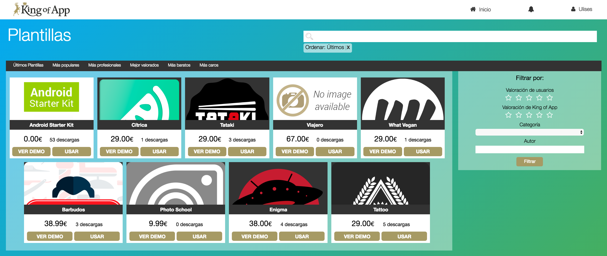
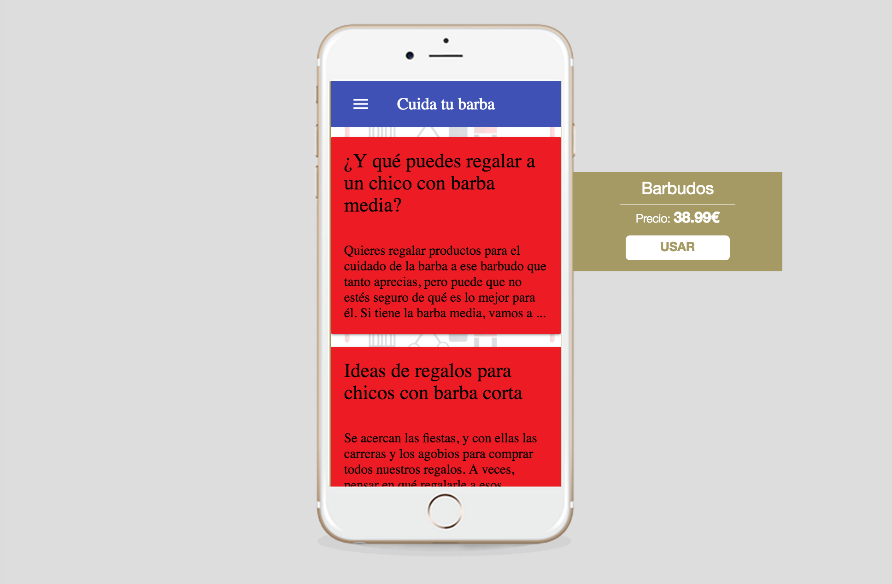

# Plantillas

La vibrante y enérgica comunidad junto con el equipo de desarrolladores de King Of App crean constantemente plantillas, si crees que ninguna plantilla se ajusta a tus necesidates y tienes experiencia como desarrollador, también puedes crear tus propias plantillas.

Las plantillas son aplicaciones preconfiguradas que nos ahorran gran cantidad de trabajo ya que incluyen módulos y temas funcionando en una perfecta armonía para un tipo de App en concreto.

No importa si quieres crear un App para tu restaurante vegano o una App de tutoriales de cocina japonesa. ¡Todo es posible con plantillas!

Para ayudar a decidirnos por una plantilla u otra podemos utilizar filtros diversos desde valoraciones mínimas, categorías... hasta autor.

Además del filtro tenemos listas que agrupan las plantillas por popularidad, profesionalidad, precios, etc...

### ¡Una dura decisión!

Para hacerte más fácil la elección de las plantillas hemos creado una opción que te permite pre-visualizar la app igual que se vería en el smartphone.

### ¡Forma parte de esto!

Por supuesto las plantillas pueden crearse por los usuarios. Las plantillas pueden hacerse públicas o privadas. Esto te permite crear aplicaciones de forma más rápida a la hora de realizar aplicaciones aplicaciones similares para diferentes clientes o compartir tu trabajo con la comunidad, si así quieres hacerlo.

El precio que aparece en cada una de ellas viene calculado en función de los plugins que tenga instalados pero no tendrás porque pagar nada si solo creas una plantilla. Recuerda que solamente tendrás que pasar por caja si deseas publicar tu App.

**Consejo 1:** Si te especializas en un nicho específico del mercado puedes desarrollar plantillas privadas y optimizar enormemente tu trabajo.

**Consejo 2:** Si has creado un tema o módulo, una plantilla es la mejor forma de dar a conocer tu trabajo.
